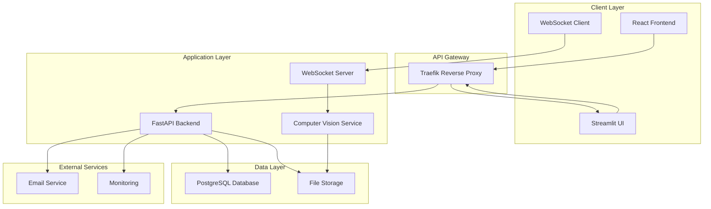
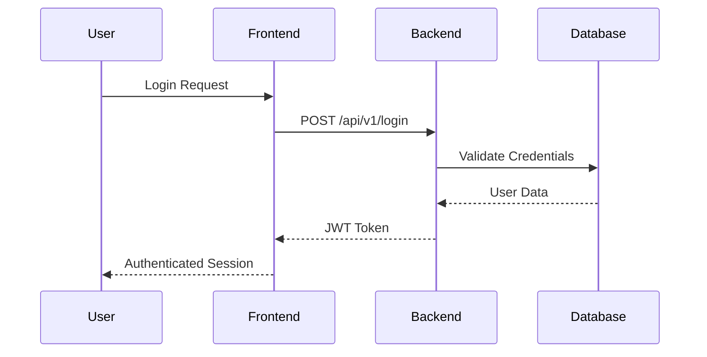
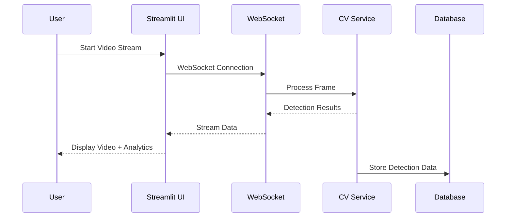
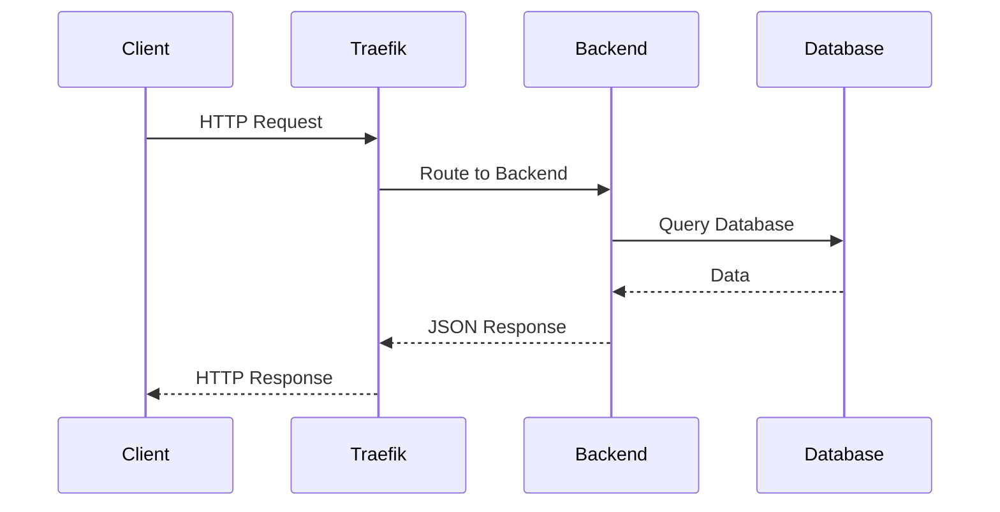

# Architecture Overview

Falcon Vision is built with a modern, scalable architecture that separates concerns and enables easy maintenance and extension.

## System Architecture



## Component Overview

### Frontend (React)
- **Technology**: React 18 with TypeScript
- **UI Library**: Chakra UI
- **State Management**: React Context + Hooks
- **Build Tool**: Vite
- **Port**: 3000

**Key Features**:
- User authentication and management
- Real-time dashboard
- Responsive design with dark mode
- Auto-generated API client

### Backend API (FastAPI)
- **Technology**: FastAPI with Python 3.11
- **ORM**: SQLModel (SQLAlchemy + Pydantic)
- **Database**: PostgreSQL
- **Authentication**: JWT tokens
- **Port**: 8000

**Key Features**:
- RESTful API with automatic OpenAPI docs
- WebSocket support for real-time communication
- User management and authentication
- Computer vision integration
- Email notifications

### Analytics UI (Streamlit)
- **Technology**: Streamlit with Python
- **Purpose**: Data visualization and analytics
- **Port**: 5174

**Key Features**:
- Real-time video streaming
- Person detection visualization
- Analytics dashboard
- Data export capabilities

### Computer Vision Service
- **Technology**: OpenCV + YOLOv8
- **Model**: YOLOv8n (nano) for person detection
- **Integration**: Embedded in FastAPI backend

**Key Features**:
- Real-time person detection
- Configurable confidence thresholds
- WebSocket streaming
- Performance optimization

## Data Flow

### 1. User Authentication Flow



### 2. Video Streaming Flow



### 3. API Request Flow



## Technology Stack

### Backend Technologies
- **FastAPI**: Modern, fast web framework
- **SQLModel**: Type-safe database ORM
- **PostgreSQL**: Reliable relational database
- **Alembic**: Database migrations
- **Pydantic**: Data validation
- **OpenCV**: Computer vision processing
- **YOLOv8**: Object detection model

### Frontend Technologies
- **React 18**: Modern UI library
- **TypeScript**: Type-safe JavaScript
- **Chakra UI**: Component library
- **Vite**: Fast build tool
- **TanStack Query**: Data fetching
- **React Router**: Client-side routing

### Infrastructure
- **Docker**: Containerization
- **Docker Compose**: Multi-container orchestration
- **Traefik**: Reverse proxy and load balancer
- **Nginx**: Static file serving
- **Let's Encrypt**: SSL certificates

### Development Tools
- **Pytest**: Python testing
- **Playwright**: End-to-end testing
- **Pre-commit**: Code quality hooks
- **Black**: Code formatting
- **MyPy**: Type checking

## Scalability Considerations

### Horizontal Scaling
- **Stateless Backend**: Easy to scale horizontally
- **Database Connection Pooling**: Efficient database connections
- **Load Balancing**: Traefik handles load distribution
- **Container Orchestration**: Ready for Kubernetes

### Performance Optimization
- **Async/Await**: Non-blocking I/O operations
- **Connection Pooling**: Efficient database connections
- **Caching**: Redis can be added for caching
- **CDN**: Static assets can be served via CDN

### Monitoring and Observability
- **Health Checks**: Built-in health monitoring
- **Logging**: Structured logging throughout
- **Metrics**: Prometheus-compatible metrics
- **Tracing**: OpenTelemetry integration ready

## Security Architecture

### Authentication & Authorization
- **JWT Tokens**: Stateless authentication
- **Password Hashing**: bcrypt for secure password storage
- **CORS Configuration**: Controlled cross-origin requests
- **Rate Limiting**: API rate limiting (configurable)

### Data Security
- **HTTPS**: Encrypted communication
- **Environment Variables**: Sensitive data in environment
- **Database Encryption**: PostgreSQL encryption at rest
- **Input Validation**: Pydantic model validation

### Network Security
- **Reverse Proxy**: Traefik handles SSL termination
- **Firewall**: Container network isolation
- **Secrets Management**: Docker secrets support

## Deployment Architecture

### Development Environment
```yaml
services:
  - frontend (React dev server)
  - backend (FastAPI with hot reload)
  - database (PostgreSQL)
  - adminer (Database admin)
```

### Production Environment
```yaml
services:
  - traefik (Reverse proxy + SSL)
  - frontend (Nginx + React build)
  - backend (FastAPI production)
  - database (PostgreSQL)
  - ui (Streamlit analytics)
```

## Future Enhancements

### Planned Features
- **Microservices**: Split into smaller services
- **Message Queue**: Redis/RabbitMQ for async processing
- **Caching Layer**: Redis for performance
- **Monitoring**: Prometheus + Grafana
- **CI/CD**: GitHub Actions pipeline

### Scalability Improvements
- **Kubernetes**: Container orchestration
- **Service Mesh**: Istio for service communication
- **Database Sharding**: Horizontal database scaling
- **CDN Integration**: Global content delivery

## Development Guidelines

### Code Organization
- **Modular Design**: Clear separation of concerns
- **Type Safety**: TypeScript and Pydantic models
- **Testing**: Comprehensive test coverage
- **Documentation**: Inline and external docs

### API Design
- **RESTful**: Standard HTTP methods and status codes
- **OpenAPI**: Auto-generated documentation
- **Versioning**: API versioning strategy
- **Error Handling**: Consistent error responses

## Next Steps

- **[Backend Architecture](backend.md)** - Deep dive into the API
- **[Frontend Architecture](frontend.md)** - React application details
- **[Computer Vision](computer-vision.md)** - CV service architecture
- **[Deployment Guide](../deployment/docker.md)** - Production deployment

