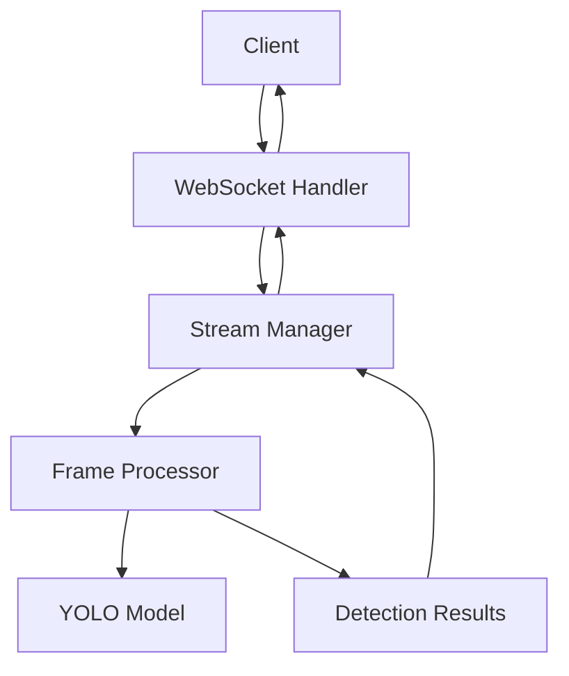

# WebSocket Implementation Guide

This guide explains how WebSocket streaming is implemented in Falcon Vision and how to extend it.

## Overview

The WebSocket implementation provides real-time video streaming with person detection. It's built on top of FastAPI's WebSocket support and integrates with the computer vision pipeline.

## Architecture



## Implementation Details

### WebSocket Handler

The main WebSocket handler is located in `backend/app/api/routes/websocket.py`:

```python
@router.websocket("/ws/video-stream")
async def websocket_endpoint(websocket: WebSocket, token: str = None):
    """WebSocket endpoint for video streaming with person detection."""
    # Authentication
    if not token:
        await websocket.close(code=1008, reason="Authentication required")
        return
    
    # Verify JWT token
    try:
        payload = jwt.decode(token, SECRET_KEY, algorithms=[ALGORITHM])
        user_id = payload.get("sub")
    except JWTError:
        await websocket.close(code=1008, reason="Invalid token")
        return
    
    # Accept connection
    await websocket.accept()
    
    # Create stream manager
    stream_manager = StreamManager(websocket, user_id)
    await stream_manager.handle_connection()
```

### Stream Manager

The `StreamManager` class handles individual WebSocket connections:

```python
class StreamManager:
    def __init__(self, websocket: WebSocket, user_id: str):
        self.websocket = websocket
        self.user_id = user_id
        self.stream_id = None
        self.frame_processor = None
        self.config = default_detection_config()
    
    async def handle_connection(self):
        """Main connection handler loop."""
        try:
            while True:
                # Receive message from client
                data = await self.websocket.receive_text()
                message = json.loads(data)
                
                # Process message based on type
                await self.process_message(message)
                
        except WebSocketDisconnect:
            await self.cleanup()
        except Exception as e:
            await self.send_error(f"Unexpected error: {str(e)}")
            await self.cleanup()
```

### Frame Processor

The `FrameProcessor` handles computer vision processing:

```python
class FrameProcessor:
    def __init__(self, config: DetectionConfig):
        self.config = config
        self.model = self.load_yolo_model()
        self.detection_history = []
    
    def load_yolo_model(self):
        """Load YOLO model for person detection."""
        model_path = "yolov8n.pt"
        return YOLO(model_path)
    
    async def process_frame(self, frame_data: str, frame_number: int) -> DetectionResults:
        """Process a single video frame."""
        # Decode base64 frame
        frame_bytes = base64.b64decode(frame_data)
        frame = cv2.imdecode(np.frombuffer(frame_bytes, np.uint8), cv2.IMREAD_COLOR)
        
        # Run detection
        results = self.model(frame, conf=self.config.confidence_threshold)
        
        # Extract person detections
        detections = []
        for result in results:
            boxes = result.boxes
            if boxes is not None:
                for box in boxes:
                    if int(box.cls[0]) == 0:  # Person class
                        detection = {
                            "class_id": int(box.cls[0]),
                            "class_name": "person",
                            "confidence": float(box.conf[0]),
                            "bbox": {
                                "x": float(box.xyxy[0][0]),
                                "y": float(box.xyxy[0][1]),
                                "width": float(box.xyxy[0][2] - box.xyxy[0][0]),
                                "height": float(box.xyxy[0][3] - box.xyxy[0][1])
                            }
                        }
                        detections.append(detection)
        
        return DetectionResults(
            frame_number=frame_number,
            detections=detections,
            processing_time_ms=self.calculate_processing_time(),
            timestamp=datetime.now().isoformat()
        )
```

## Message Types

### Client to Server Messages

#### Start Stream
```json
{
  "type": "start_stream",
  "data": {
    "stream_id": "unique_stream_id",
    "config": {
      "confidence_threshold": 0.5,
      "max_detections": 100,
      "detection_classes": ["person"]
    }
  }
}
```

#### Video Frame
```json
{
  "type": "video_frame",
  "data": {
    "stream_id": "unique_stream_id",
    "frame_data": "base64_encoded_image",
    "frame_number": 123,
    "timestamp": "2024-01-01T12:00:00Z"
  }
}
```

#### Update Config
```json
{
  "type": "update_config",
  "data": {
    "stream_id": "unique_stream_id",
    "config": {
      "confidence_threshold": 0.7,
      "max_detections": 50
    }
  }
}
```

#### Stop Stream
```json
{
  "type": "stop_stream",
  "data": {
    "stream_id": "unique_stream_id"
  }
}
```

### Server to Client Messages

#### Detection Results
```json
{
  "type": "detection_results",
  "data": {
    "stream_id": "unique_stream_id",
    "frame_number": 123,
    "detections": [...],
    "processing_time_ms": 45,
    "timestamp": "2024-01-01T12:00:00Z"
  }
}
```

#### Stream Status
```json
{
  "type": "stream_status",
  "data": {
    "stream_id": "unique_stream_id",
    "status": "active",
    "fps": 30,
    "total_frames": 1500,
    "detections_count": 45
  }
}
```

#### Error
```json
{
  "type": "error",
  "data": {
    "stream_id": "unique_stream_id",
    "error_code": "INVALID_FRAME",
    "message": "Invalid frame format",
    "timestamp": "2024-01-01T12:00:00Z"
  }
}
```

## Configuration

### Detection Configuration

```python
@dataclass
class DetectionConfig:
    confidence_threshold: float = 0.5
    max_detections: int = 100
    detection_classes: List[str] = field(default_factory=lambda: ["person"])
    iou_threshold: float = 0.45
    input_size: int = 640
    enable_analytics: bool = True
```

### Stream Configuration

```python
@dataclass
class StreamConfig:
    max_fps: int = 30
    buffer_size: int = 10
    timeout_seconds: int = 30
    enable_compression: bool = True
    max_frame_size: int = 5 * 1024 * 1024  # 5MB
```

## Error Handling

### Error Codes

| Code | Description | Action |
|------|-------------|--------|
| `INVALID_TOKEN` | Invalid or expired JWT token | Re-authenticate |
| `INVALID_FRAME` | Invalid frame format | Check frame encoding |
| `STREAM_NOT_FOUND` | Stream ID not found | Create new stream |
| `DETECTION_FAILED` | Detection processing failed | Retry or check config |
| `RATE_LIMIT_EXCEEDED` | Too many requests | Wait and retry |
| `FRAME_TOO_LARGE` | Frame exceeds size limit | Reduce frame size |
| `INVALID_CONFIG` | Invalid configuration | Check config parameters |

### Error Handling Implementation

```python
class WebSocketError(Exception):
    def __init__(self, code: str, message: str):
        self.code = code
        self.message = message

async def handle_error(error: WebSocketError, websocket: WebSocket, stream_id: str = None):
    """Handle WebSocket errors."""
    error_message = {
        "type": "error",
        "data": {
            "stream_id": stream_id,
            "error_code": error.code,
            "message": error.message,
            "timestamp": datetime.now().isoformat()
        }
    }
    
    try:
        await websocket.send_text(json.dumps(error_message))
    except Exception:
        # Connection might be closed
        pass
```

## Performance Optimization

### Frame Processing Optimization

```python
class OptimizedFrameProcessor:
    def __init__(self, config: DetectionConfig):
        self.config = config
        self.model = self.load_yolo_model()
        self.frame_queue = asyncio.Queue(maxsize=10)
        self.processing_task = None
    
    async def start_processing(self):
        """Start background frame processing."""
        self.processing_task = asyncio.create_task(self._process_frames())
    
    async def _process_frames(self):
        """Background frame processing loop."""
        while True:
            try:
                frame_data = await self.frame_queue.get()
                await self.process_frame(frame_data)
            except Exception as e:
                logger.error(f"Frame processing error: {e}")
    
    async def queue_frame(self, frame_data: str, frame_number: int):
        """Queue frame for processing."""
        try:
            await self.frame_queue.put((frame_data, frame_number))
        except asyncio.QueueFull:
            # Drop oldest frame if queue is full
            try:
                self.frame_queue.get_nowait()
                await self.frame_queue.put((frame_data, frame_number))
            except asyncio.QueueEmpty:
                pass
```

### Memory Management

```python
class MemoryManager:
    def __init__(self, max_memory_mb: int = 500):
        self.max_memory_bytes = max_memory_mb * 1024 * 1024
        self.current_memory = 0
        self.frame_cache = {}
    
    def can_process_frame(self, frame_size: int) -> bool:
        """Check if we can process a frame without exceeding memory limit."""
        return self.current_memory + frame_size < self.max_memory_bytes
    
    def cleanup_old_frames(self):
        """Clean up old frames to free memory."""
        if len(self.frame_cache) > 100:  # Keep only last 100 frames
            oldest_frames = sorted(self.frame_cache.keys())[:-100]
            for frame_id in oldest_frames:
                self.current_memory -= self.frame_cache[frame_id]['size']
                del self.frame_cache[frame_id]
```

## Testing

### Unit Tests

```python
import pytest
from unittest.mock import Mock, AsyncMock
from app.api.routes.websocket import StreamManager

@pytest.mark.asyncio
async def test_stream_manager_start_stream():
    """Test starting a video stream."""
    websocket = AsyncMock()
    stream_manager = StreamManager(websocket, "user123")
    
    message = {
        "type": "start_stream",
        "data": {
            "stream_id": "test_stream",
            "config": {"confidence_threshold": 0.5}
        }
    }
    
    await stream_manager.process_message(message)
    
    assert stream_manager.stream_id == "test_stream"
    assert stream_manager.config.confidence_threshold == 0.5
    websocket.send_text.assert_called_once()
```

### Integration Tests

```python
@pytest.mark.asyncio
async def test_websocket_connection():
    """Test WebSocket connection and message handling."""
    client = TestClient(app)
    
    with client.websocket_connect("/ws/video-stream?token=test_token") as websocket:
        # Send start stream message
        websocket.send_json({
            "type": "start_stream",
            "data": {
                "stream_id": "test_stream",
                "config": {"confidence_threshold": 0.5}
            }
        })
        
        # Receive response
        data = websocket.receive_json()
        assert data["type"] == "stream_started"
        assert data["data"]["stream_id"] == "test_stream"
```

## Monitoring and Debugging

### Connection Monitoring

```python
class ConnectionMonitor:
    def __init__(self):
        self.active_connections = {}
        self.connection_stats = {}
    
    def register_connection(self, connection_id: str, user_id: str):
        """Register a new connection."""
        self.active_connections[connection_id] = {
            "user_id": user_id,
            "start_time": datetime.now(),
            "frames_processed": 0,
            "last_activity": datetime.now()
        }
    
    def update_stats(self, connection_id: str, frames_processed: int):
        """Update connection statistics."""
        if connection_id in self.active_connections:
            self.active_connections[connection_id]["frames_processed"] += frames_processed
            self.active_connections[connection_id]["last_activity"] = datetime.now()
    
    def get_stats(self) -> dict:
        """Get connection statistics."""
        return {
            "active_connections": len(self.active_connections),
            "total_frames_processed": sum(
                conn["frames_processed"] for conn in self.active_connections.values()
            ),
            "connections": self.active_connections
        }
```

### Logging

```python
import logging

# Configure logging
logging.basicConfig(level=logging.INFO)
logger = logging.getLogger(__name__)

class WebSocketLogger:
    @staticmethod
    def log_connection(user_id: str, connection_id: str):
        logger.info(f"WebSocket connection established: user={user_id}, connection={connection_id}")
    
    @staticmethod
    def log_disconnection(user_id: str, connection_id: str, reason: str = None):
        logger.info(f"WebSocket connection closed: user={user_id}, connection={connection_id}, reason={reason}")
    
    @staticmethod
    def log_frame_processed(connection_id: str, frame_number: int, processing_time: float):
        logger.debug(f"Frame processed: connection={connection_id}, frame={frame_number}, time={processing_time}ms")
```

## Security Considerations

### Authentication

```python
async def authenticate_websocket(token: str) -> Optional[str]:
    """Authenticate WebSocket connection."""
    try:
        payload = jwt.decode(token, SECRET_KEY, algorithms=[ALGORITHM])
        user_id = payload.get("sub")
        
        # Verify user exists and is active
        user = await get_user_by_id(user_id)
        if not user or not user.is_active:
            return None
        
        return user_id
    except JWTError:
        return None
```

### Rate Limiting

```python
class WebSocketRateLimiter:
    def __init__(self, max_requests_per_minute: int = 60):
        self.max_requests = max_requests_per_minute
        self.requests = {}
    
    def is_allowed(self, connection_id: str) -> bool:
        """Check if connection is within rate limit."""
        now = datetime.now()
        minute_ago = now - timedelta(minutes=1)
        
        # Clean old requests
        if connection_id in self.requests:
            self.requests[connection_id] = [
                req_time for req_time in self.requests[connection_id]
                if req_time > minute_ago
            ]
        else:
            self.requests[connection_id] = []
        
        # Check rate limit
        if len(self.requests[connection_id]) >= self.max_requests:
            return False
        
        # Add current request
        self.requests[connection_id].append(now)
        return True
```

## Extending the Implementation

### Adding New Message Types

1. Define the message structure
2. Add handler in `StreamManager.process_message()`
3. Implement the business logic
4. Add tests
5. Update documentation

### Custom Detection Models

1. Create a new model class inheriting from `BaseDetector`
2. Implement the `detect()` method
3. Register the model in the factory
4. Update configuration options

### Additional Features

- **Multi-stream support**: Handle multiple streams per connection
- **Stream recording**: Save streams to disk
- **Advanced analytics**: Real-time statistics and metrics
- **Custom filters**: Apply image filters before detection
- **Batch processing**: Process multiple frames together

## Next Steps

- **[WebSocket API Reference](../api/websocket-streaming.md)** - Complete API documentation
- **[Computer Vision Architecture](../architecture/computer-vision.md)** - CV system details
- **[Performance Optimization](../development/optimization.md)** - Performance tuning guide

