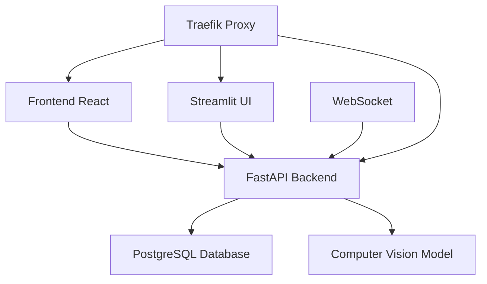

# Falcon Vision Documentation

Welcome to the Falcon Vision documentation! This comprehensive guide will help you understand, deploy, and develop with our computer vision application.

## What is Falcon Vision?

Falcon Vision is a full-stack computer vision application that provides real-time person detection and analytics capabilities. Built with modern technologies, it offers:

- **Real-time Video Streaming**: WebSocket-based video streaming with person detection
- **Advanced Analytics**: Comprehensive analytics dashboard with detection metrics
- **Modern Architecture**: FastAPI backend, React frontend, and Streamlit UI
- **Docker Ready**: Complete containerization with Docker Compose
- **Production Ready**: Traefik reverse proxy with automatic HTTPS

## Quick Start

Get up and running in minutes:

```bash
# Clone the repository
git clone https://github.com/falcon-vision/falcon-vision.git
cd falcon-vision

# Start with Docker Compose
docker-compose up -d
```

Visit the applications:
- **Dashboard**: `https://dashboard.yourdomain.com`
- **API Docs**: `https://api.yourdomain.com/docs`
- **Analytics UI**: `https://beta.yourdomain.com`

## Architecture Overview



## Key Features

### 🎯 Person Detection
- Real-time person detection using YOLOv8
- WebSocket streaming for low-latency video
- Configurable detection parameters

### 📊 Analytics Dashboard
- Real-time detection metrics
- Historical data visualization
- Export capabilities

### 🔐 Authentication
- JWT-based authentication
- User management system
- Role-based access control

### 🚀 Deployment
- Docker containerization
- Traefik reverse proxy
- Automatic HTTPS certificates
- Production-ready configuration

## Getting Started

Choose your path:

- **[Installation Guide](getting-started/installation.md)** - Set up your development environment
- **[Quick Start](getting-started/quick-start.md)** - Get running in 5 minutes
- **[Configuration](getting-started/configuration.md)** - Customize your setup

## Documentation Sections

### Architecture
Learn about the system architecture and components:
- [Architecture Overview](architecture/overview.md)
- [Backend API](architecture/backend.md)
- [Frontend](architecture/frontend.md)
- [UI Dashboard](architecture/ui.md)
- [Computer Vision](architecture/computer-vision.md)

### API Reference
Comprehensive API documentation:
- [Authentication](api/authentication.md)
- [WebSocket Streaming](api/websocket-streaming.md)
- [Person Detection](api/person-detection.md)
- [Analytics](api/analytics.md)

### Development
Resources for developers:
- [Development Setup](development/setup.md)
- [Testing](development/testing.md)
- [Contributing](development/contributing.md)

### Deployment
Production deployment guides:
- [Docker](deployment/docker.md)
- [Production](deployment/production.md)
- [Environment Variables](deployment/environment.md)

## Support

- **GitHub Issues**: [Report bugs or request features](https://github.com/falcon-vision/falcon-vision/issues)
- **Documentation**: This site contains comprehensive guides
- **Community**: Join our discussions on GitHub

## License

This project is licensed under the MIT License - see the [LICENSE](https://github.com/falcon-vision/falcon-vision/blob/main/LICENSE) file for details.

